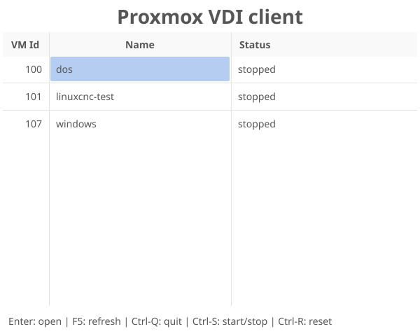

# Proxmox VDI Client

Proxmox VDI client is a small launcher that starts a remote-viewer session for proxmox virtual machines.




It opens [Virt-Viewer](https://www.spice-space.org/download.html) / remote-viewer for the selected VMs.

It is inspired by [PVE-VFIClient](https://github.com/joshpatten/PVE-VDIClient)

## Usage

```
Usage of proxmox-vdiclient [flags] [vmid/name [operation]]:

  operations: status, start, stop, reset, open (default)

  -autostart-vm
    	start stopped VMs before opening (default true)
  -config value
    	Path to config file (default ~/.config/proxmox-vdiclient/proxmox-vdiclient.conf)
  -fullscreen
    	fullscreen mode
  -host string
    	proxmox hostname
  -kiosk
    	kiosk mode
  -override-theme string
    	override theme (dark/light)
  -port int
    	proxmox port (default 8006)
  -refresh-interval duration
    	refresh interval (default 30s)
  -remote-viewer string
    	remote viewer executable (default "remote-viewer")
  -title string
    	title shown in gui (default "proxmox-vdiclient")
  -token-name string
    	token name
  -token-value string
    	token value
  -unsafe-skip-tls-verify
    	skip TLS certificate verification
```

## Configuration file

The configuration file is a simple file with one option per line. Comment lines with '#' are ignored.

Commandline options can be set from the configuration file.
The default configuration file is loaded before options are processed.

Example:
```
title = Available VMs on your Proxmox
host = hostname.proxmox.server
# start remote-viewer in fullscreen mode
fullscreen = true

token-name = user@hostname!token
token-value = 12345678-abcd-1234-5678-1234567890ab
```

## Authentication

Proxmox VDI client currently only supports proxmox token authentication.

You can create tokens in Proxmox at Datacenter / Permissions / API Tokens.

## Permissions

You add the VMs you want to show to a resource pool. Then you add the token to the resource pool with these permissions:

| Permission   | needed for                     |
|--------------|--------------------------------|
| VM.Audit     | list and query VM              |
| VM.Console   | open SPICE session             |
| VM.PowerMgmt | start/stop/reset VM (optional) |


## Building


### Linux

requires x11 development libraries (for fyne)

`go build`

### cross compiling for windows:

requires mingw64-gcc

`LANG=C GOOS=windows GOARCH=amd64 CGO_ENABLED=1 CC=x86_64-w64-mingw32-gcc go build -v`